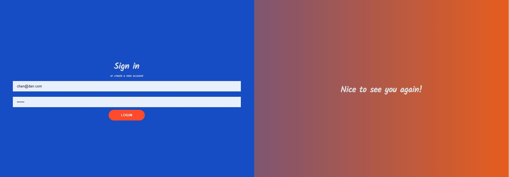

# On-Stage


## Description
This website allows the user to register and login to a dashboard containing information they submit. This application is developed almost entirely with React.js in tandem with GraphQL, PostgreSQL, and Prisma 2.

## Features

The features and information this application includes,
- Password Encryption
- Authentication
- Route Protection
- Form Validation

## User Story

```
As a user, I want
    -to be able to quickly create an account with my information
so that
    -I can be taken to a dashboard containing my information

```

## Deployment

This app is deployed [here](https://still-retreat-65409.herokuapp.com/)


## Installation

To run this application locally, please clone to repository to your local machine.

This application functions in a backend enviornment at http://localhost:5000/ and a frontend enviornment at http://localhost:3000/

Then run the following sets of commands in this order:

`cd into server folder / npm install / npm start`

`cd into onstage-client folder / npm install / npm start`

## License

This project is licensed under the `MIT license`.

## Contributors

| Chandler
------------ 

[<br /><sub><b>Chandler Lowrance</b></sub>](https://github.com/Chandler8)<br />[💻](https://github.com/Chandler8?tab=repositories "Repositories")

## Future Development

As this application was required to be completed in a 12 hour window some of the outcomes where not as polished as I would have liked. Issues exist with deployment and data fetching however, neither hinder the application from performing well locally. This login/register form could have been completed much quicker and more efficiently by utilizing AWS and some of its built in features like Cognito for user authorization and Amplify for deployment. Being restricted to a new and smaller tech stack for this assignment was exciting and led to me learning a lot.

## Media

